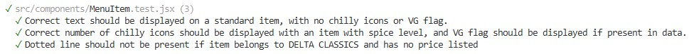
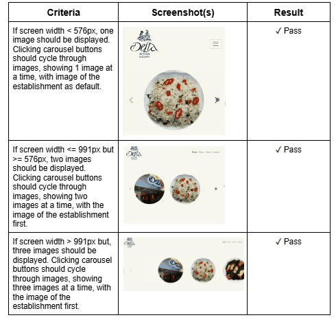
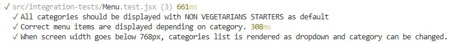
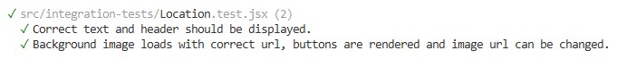

# Delta Indian Takwaway
about
am i responsive image

## Live Site

## Repository

## Author

## Table of Contents

## Project Goals and PLanning

## UX

### Target Audience

### User Stories

### Fonts

### Images

## Testing
### Automated Testing
Several automated test suites were created using Vitest and React Testing Library. These were divided into two categories:
#### Unit Tests
Two components required data to be passed in as props and were complex enough to require an automated test file. Screeenshots of the test results and link to folder location are given below.

[Image.test.jsx](https://github.com/AlexSmall96/Delta-Indian-Takeaway/blob/main/src/components/Image.test.jsx)

[MenuItem.test.jsx](https://github.com/AlexSmall96/Delta-Indian-Takeaway/blob/main/src/components/MenuItem.test.jsx)

### Manual Testing
The home page was tested manually. This invovled verifying that the correct number of images was displayed according to screen size and that the caroulel cycled through the correct set of images. 

#### Integration Tests
The two pages which invovled user interactivity (Menu and Location) were tested using integration tests.
Screenshots of the test results and link to folder location are given below.

[Menu.test.jsx](https://github.com/AlexSmall96/Delta-Indian-Takeaway/blob/main/src/integration-tests/Menu.test.jsx)

[Location.test.jsx](https://github.com/AlexSmall96/Delta-Indian-Takeaway/blob/main/src/integration-tests/Location.test.jsx)

## Programming Languages, Frameworks and Libraries used
- Backend
    - Node.js
    - Express
- Frontend
    - React
    - React Bootstrap
- Testing
    - Vitest
    - React Testing Library
    - Mock Service Worker
## Other technologies used
- Deployment
    - Render
- Images
    - Cloudinary
    - Google Maps Static API
- Development
    - VS code
    - GitHub
## Credits
I'd like to thank Umar Majid and his family for entrusting me to develop the website for their family business. I'd also like to thank Umar for his support and feedback throughout the project, as well as his assistance in deploying the site to his custom domain.
### Courses
- [https://www.udemy.com/course/react-testing-library](https://www.udemy.com/course/react-testing-library)
### APIS
- The background image on the About page makes use of the google maps static API (with proper attribution): https://developers.google.com/maps/documentation/maps-static

### Code
- The code for the useWindowDimensions.jsx hook was taken from https://stackoverflow.com/questions/36862334/get-viewport-window-height-in-reactjs