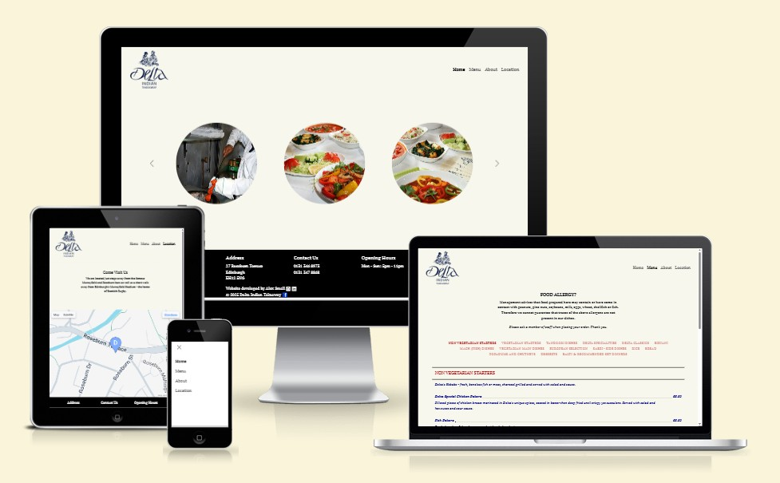

# Delta Indian Takeaway


Delta is an Indian Takeaway located in Edinburgh, Scotland. This repository serves as the website for the business, providing information on the menu, location, availability, and means of contact.



### [🌐 Live Site](https://www.deltaindiantakeaway.co.uk/)

The website is deployed as a static site on Render. This deployment type was selected to ensure that the main site loads instantly with zero costs. This repository was also deployed as a lightweight backend to Render's free-tier web service to supply the map image using the Google Maps API. A small delay in loading the map was accepted as a deliberate trade-off to minimize hosting costs. 

### [📖 Repository](https://github.com/AlexSmall96/Delta-Indian-Takeaway/)

## 🔍 Key Features
- Responsive landing page with a gallery showcasing featured dishes.
- Interactive menu with category filtering, allergen information, and spice level indicators.
- Contact information, opening hours, location details, and available services.
- Fully responsive design for mobile, tablet, and desktop devices.
- Reusable React components.
- Clean, user-friendly location information using the Google Maps API.
- Integration and component testing.
## Tech Stack
| Backend | Frontend | Testing (Vitest) | Other Tools 
| :---: | :----: | :----: |:----: | 
| Node | React | React Testing Library | Cloudinary
| Express | React Bootstrap | Mock Service Worker | Render
## 🧪 Testing Strategy
This project uses a combination of component testing, integration testing, and manual testing to help ensure reliability and maintainability.

**Integration tests** were used to verify core user flows such as 
- Viewing and navigating through Home page images
- Menu interactions
- Location page map

**Component tests** were added to a selection of components to ensure content was displayed correctly based on props.

Responsive behaviour and navigation/routing were tested manually during development and in the production environment.

Tools used: Vitest, React Testing Library, MSW

## Future Improvements
- Upgrade the backend hosting plan to eliminate map loading delays caused by cold starts.
- Add an online ordering system to allow customers to place orders directly through the website.
- Enhance the location page with interactive map functionality and directions.
- Add end-to-end testing with Playwright to validate key user journeys.

## 💻 Setup
1. Clone the repository

    ```git clone https://github.com/AlexSmall96/Delta-Indian-Takeaway ``` 

2. Install dependencies:

    ```npm install```
3. Start the development server:

   ```npm start```
   
The application uses a deployed backend service for map generation, so no local backend setup is required.
## 👤Author
Alex Small | [GitHub](https://github.com/AlexSmall96) | [LinkedIn](https://www.linkedin.com/in/alex-small-a8977116b/)

## 🤝 Credits
I would like to thank Umar Majid and his family for entrusting me to develop the website for their family business. I'd also like to thank Umar for his support and feedback throughout the project, as well as his assistance in deploying the site to his custom domain.
### Courses
Bonnie Schulkin's Udemy course on React Testing Library was used as learning material and a reference for testing best practies. Concepts were used and adapted as necessary for this project.

[React Testing Library with Jest/Vitest](https://www.udemy.com/course/react-testing-library), Bonnie Schulkin
### APIs
The background image on the About page makes use of the Google Maps static API (with proper attribution): https://developers.google.com/maps/documentation/maps-static

### Code
The code for the useWindowDimensions.jsx hook was taken from https://stackoverflow.com/questions/36862334/get-viewport-window-height-in-reactjs
