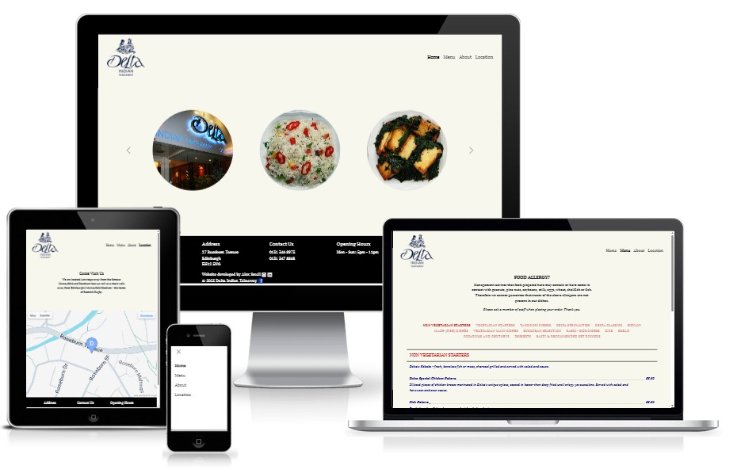
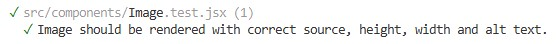
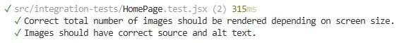

# Delta Indian Takeaway
Delta is an Indian Takeaway located in Edinburgh, Scotland. This repository serves as the website for the business, providing information on the menu, location, availability, and means of contact.

## Live Site
https://www.deltaindiantakeaway.co.uk

## Repository
https://github.com/AlexSmall96/Delta-Indian-Takeaway
## Author
Alex Small
## Table of Contents
- [Delta Indian Takeaway](#delta-indian-takeaway)
  * [Live Site](#live-site)
  * [Repository](#repository)
  * [Author](#author)
  * [Table of Contents](#table-of-contents)
  * [Project Goals and Planning](#project-goals-and-planning)
  * [UX](#ux)
    + [Target Audience](#target-audience)
    + [User Stories](#user-stories)
    + [Fonts](#fonts)
    + [Images](#images)
  * [Testing](#testing)
    + [Automated Testing](#automated-testing)
      - [Unit Tests](#unit-tests)
      - [Integration Tests](#integration-tests)
    + [Manual Testing](#manual-testing)
  * [Programming Languages, Frameworks and Libraries used](#programming-languages--frameworks-and-libraries-used)
  * [Other technologies used](#other-technologies-used)
  * [Credits](#credits)
    + [Courses](#courses)
    + [APIs](#apis)
    + [Code](#code)
## Project Goals and Planning
The goal of this project was to provide a fully functioning website for a real business, addressing the needs of the owners while helping promote the business. This project also allowed me to develop my skills in React and automated testing. 
## UX
### Target Audience
The target audience of this site is anyone who enjoys great Indian cuisine, as well as other businesses looking for larger-scale catering for events.
### User Stories
The following user stories were taken into account and the content of the website was planned accordingly.

As a member of the public, I want to:
- Get an overview of the Delta menu via images.
- View the full menu with a detailed description of each dish.
- Learn more about the background of the business.
- View clear directions to help me find the business location.
- Easily contact the business.

As an event organiser, I want to:
- View the full menu with a detailed description of each dish.
- Find clear information on Delta's availability for catering.
- Easily contact the business.

### Fonts
The fonts used on the site are PT Serif and Roboto from Google Fonts.
### Images
The home page features images of the menu and the interior and exterior of the restaurant. These were supplied directly by the business owners.

The about page features a background image of the delta of the Ganges-Brahmaputra river in Bangladesh, from which the business derives its name.

The background map image on the location page makes use of the Google Maps static API: https://developers.google.com/maps/documentation/maps-static
## Testing
### Automated Testing
Several automated test suites were created using Vitest and React Testing Library. These were divided into two categories:
#### Unit Tests
Two components required data to be passed in as props and were complex enough to require an automated test file. Screenshots of the test results and file locations are given below.

[Image.test.jsx](https://github.com/AlexSmall96/Delta-Indian-Takeaway/blob/main/src/components/Image.test.jsx)

[MenuItem.test.jsx](https://github.com/AlexSmall96/Delta-Indian-Takeaway/blob/main/src/components/MenuItem.test.jsx)

#### Integration Tests
The three pages that involved user interactivity (Menu, Location, and Home page) were tested using integration tests.
Screenshots of the test results and file locations are given below.

[Menu.test.jsx](https://github.com/AlexSmall96/Delta-Indian-Takeaway/blob/main/src/integration-tests/Menu.test.jsx)

[Location.test.jsx](https://github.com/AlexSmall96/Delta-Indian-Takeaway/blob/main/src/integration-tests/Location.test.jsx)

[HomePage.test.jsx](https://github.com/AlexSmall96/Delta-Indian-Takeaway/blob/main/src/integration-tests/Location.test.jsx)

### Manual Testing
Additional features of the home page were tested manually. This involved verifying that the correct number of images per carousel item was displayed according to screen size and that the carousel cycled through the correct set of images. 

## Programming Languages, Frameworks, and Libraries used
- Backend
    - Node.js
    - Express
- Frontend
    - React
    - React Bootstrap
- Testing
    - Vitest
    - React Testing Library
    - Mock Service Worker
## Other technologies used
- Deployment
    - Render
- Images
    - Cloudinary
    - Google Maps Static API
    - RealFaviconGenerator
- Development
    - VS Code
    - GitHub
## Credits
I would like to thank Umar Majid and his family for entrusting me to develop the website for their family business. I'd also like to thank Umar for his support and feedback throughout the project, as well as his assistance in deploying the site to his custom domain.
### Courses
- [https://www.udemy.com/course/react-testing-library](https://www.udemy.com/course/react-testing-library)
### APIs
- The background image on the About page makes use of the Google Maps static API (with proper attribution): https://developers.google.com/maps/documentation/maps-static

### Code
- The code for the useWindowDimensions.jsx hook was taken from https://stackoverflow.com/questions/36862334/get-viewport-window-height-in-reactjs
